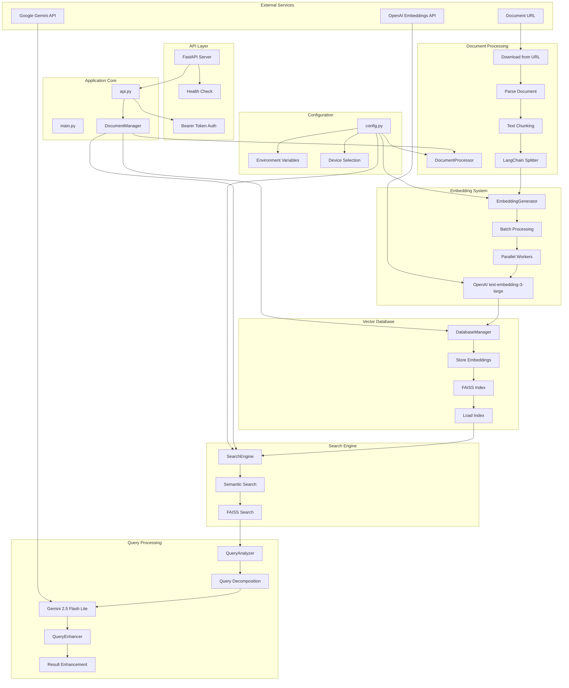
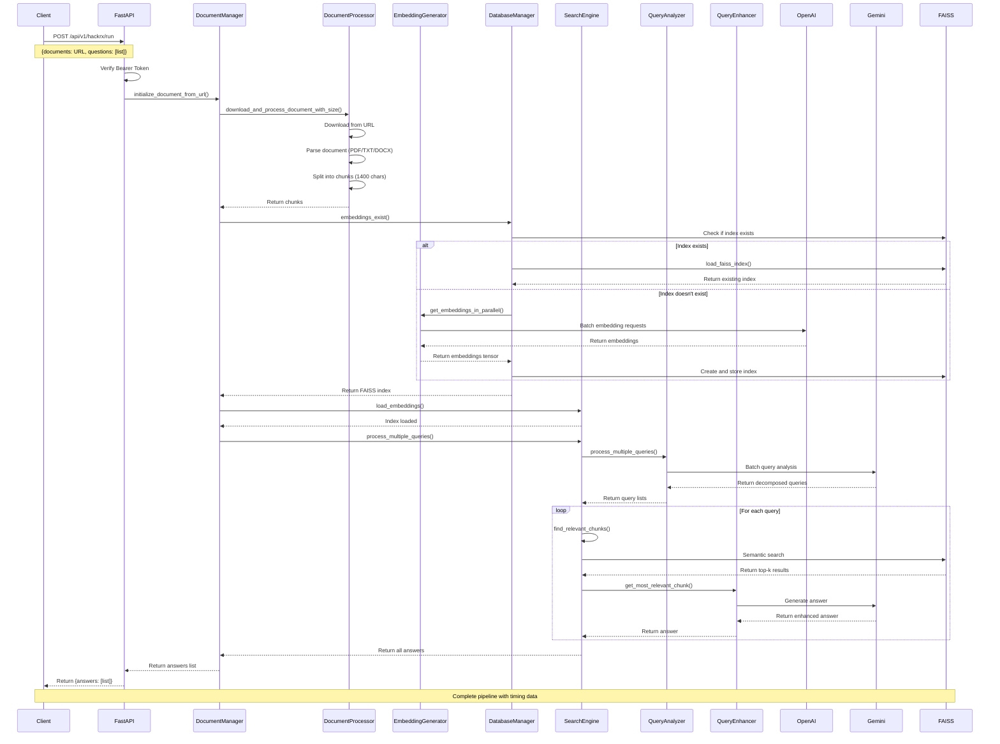
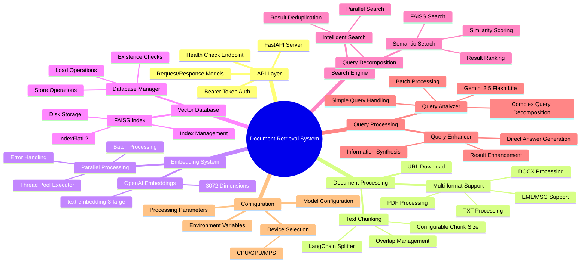
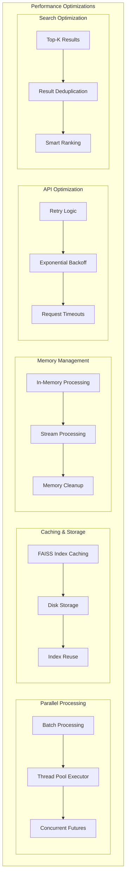

# Document Retrieval System Architecture

## Complete System Architecture Diagram

## Detailed Component Architecture

```mermaid
graph LR
    %% User Request Flow
    subgraph "1. User Request"
        USER[User]
        REQUEST[POST /api/v1/hackrx/run]
        DOC_URL[Document URL]
        QUESTIONS[Questions List]
    end

    %% Authentication
    subgraph "2. Authentication"
        BEARER[Bearer Token]
        VERIFY[Token Verification]
    end

    %% Document Processing Pipeline
    subgraph "3. Document Processing"
        DOWNLOAD[Download Document]
        PROCESS[Process Document]
        CHUNK[Split into Chunks]
        CHUNK_SIZE[1400 chars/chunk]
        OVERLAP[100 chars overlap]
    end

    %% Embedding Generation
    subgraph "4. Embedding Generation"
        EMBED[Generate Embeddings]
        BATCH_SIZE[Batch Size: 50]
        WORKERS[Max Workers: 10]
        MODEL[text-embedding-3-large]
        DIM[3072 dimensions]
    end

    %% Vector Storage
    subgraph "5. Vector Storage"
        FAISS_CREATE[Create FAISS Index]
        FAISS_STORE[Store on Disk]
        FAISS_LOAD[Load for Search]
        INDEX_PATH[document_embeddings_*.faiss]
    end

    %% Query Processing
    subgraph "6. Query Processing"
        ANALYZE[Query Analysis]
        DECOMPOSE[Complex Query Decomposition]
        SIMPLE[Simple Query Handling]
        PARALLEL_SEARCH[Parallel Search]
    end

    %% Search Execution
    subgraph "7. Search Execution"
        SEMANTIC_SEARCH[Semantic Search]
        TOP_K[Top 5 Results]
        SCORE[Similarity Scoring]
        RANK[Result Ranking]
    end

    %% Answer Generation
    subgraph "8. Answer Generation"
        ENHANCE[Result Enhancement]
        SYNTHESIZE[Information Synthesis]
        DIRECT_ANSWER[Direct Answer Generation]
        CONCISE[1-2 Sentence Response]
    end

    %% Response
    subgraph "9. Response"
        ANSWERS[Answers List]
        TIMING[Timing Data]
        METADATA[Processing Metadata]
    end

    %% Flow Connections
    USER --> REQUEST
    REQUEST --> DOC_URL
    REQUEST --> QUESTIONS
    REQUEST --> BEARER
    
    BEARER --> VERIFY
    VERIFY --> DOWNLOAD
    
    DOWNLOAD --> PROCESS
    PROCESS --> CHUNK
    CHUNK --> CHUNK_SIZE
    CHUNK --> OVERLAP
    
    CHUNK --> EMBED
    EMBED --> BATCH_SIZE
    EMBED --> WORKERS
    EMBED --> MODEL
    EMBED --> DIM
    
    EMBED --> FAISS_CREATE
    FAISS_CREATE --> FAISS_STORE
    FAISS_STORE --> INDEX_PATH
    FAISS_STORE --> FAISS_LOAD
    
    QUESTIONS --> ANALYZE
    ANALYZE --> DECOMPOSE
    ANALYZE --> SIMPLE
    DECOMPOSE --> PARALLEL_SEARCH
    SIMPLE --> PARALLEL_SEARCH
    
    FAISS_LOAD --> SEMANTIC_SEARCH
    PARALLEL_SEARCH --> SEMANTIC_SEARCH
    SEMANTIC_SEARCH --> TOP_K
    SEMANTIC_SEARCH --> SCORE
    SCORE --> RANK
    
    RANK --> ENHANCE
    ENHANCE --> SYNTHESIZE
    SYNTHESIZE --> DIRECT_ANSWER
    DIRECT_ANSWER --> CONCISE
    
    CONCISE --> ANSWERS
    ANSWERS --> TIMING
    ANSWERS --> METADATA
    
    
    class USER,REQUEST,DOC_URL,QUESTIONS request
    class BEARER,VERIFY auth
    class DOWNLOAD,PROCESS,CHUNK,CHUNK_SIZE,OVERLAP processing
    class EMBED,BATCH_SIZE,WORKERS,MODEL,DIM embedding
    class FAISS_CREATE,FAISS_STORE,FAISS_LOAD,INDEX_PATH storage
    class ANALYZE,DECOMPOSE,SIMPLE,PARALLEL_SEARCH query
    class SEMANTIC_SEARCH,TOP_K,SCORE,RANK search
    class ENHANCE,SYNTHESIZE,DIRECT_ANSWER,CONCISE answer
    class ANSWERS,TIMING,METADATA response
```

## Data Flow Architecture

## System Components Overview

## Performance Optimization Features

This comprehensive architecture diagram shows:

1. **Complete System Flow**: From user request to response
2. **Component Interactions**: How each module communicates
3. **Data Processing Pipeline**: Document processing, embedding generation, and search
4. **External Dependencies**: Google Gemini and OpenAI APIs
5. **Performance Optimizations**: Parallel processing, caching, and memory management
6. **Configuration Management**: Environment variables and device selection

The system is designed for high-performance document retrieval with intelligent query processing and semantic search capabilities. 